# MVE-1: Enkele film ophalen

In deze story gaan we een Spring Boot applicatie aanmaken met een enkel endpoint om een film te serveren aan de client.

## Acceptatie criteria

Als filmliefhebber wil ik de details van een film kunnen raadplegen op basis van een id. Het endpoint moet er als volgt uitzien:

---
Verzoek:

`GET /films/123`

Antwoord:

```json
{
    "titel":"The Ususal Suspects",
    "releaseJaar":1995,
    "acteurs":[
        "Chazz Palminteri",
        "Kevin Spacey",
        "Gabriel Byrne"
    ],
    "duur":"PT1H46M",
    "regisseur":"Bryan Singer",
    "id":"123"
}
```
---
Verzoek:

`GET /films/456`

Antwoord:
```json
{
    "titel":"Donnie Darko",
    "releaseJaar":2001,
    "acteurs":[
        "Jena Malone",
        "Mary McDonnell",
        "Jake Gyllenhaal"
    ],
    "duur":"PT1H53M",
    "regisseur":"Richard Kelly",
    "id":"456"
}
```
---
Verzoek:

`GET /films/789`

Antwoord:

```json
{
    "titel":"Once Upon a Time in the West",
    "releaseJaar":1968,
    "acteurs":[
        "Henry Fonda",
        "Charles Bronson",
        "Claudia Cardinale"
    ],
    "duur":"PT2H45M",
    "regisseur":"Sergio Leone",
    "id":"789"
}
```
---

## Stappenplan
Om aan de acceptatie criteria te kunnen voldoen gaan wij:
* Een nieuwe Spring Boot applicatie maken
* Een model klasse (`POJO` --> Plain Old Java Object) maken voor een `Film`
* Een `RestController` maken om het endpoint te definieren

### Nieuwe Spring Boot applicatie maken

Voor een nieuwe Spring Boot applicatie gaan we gebruik maken van de [SPRING INITIALIZR](https://start.spring.io/).

Hierbij vullen wij de volgende gegevens in (dit zijn enkel voorbeelden, je mag ook zelf iets bedenken):
* Group:  `nl.rechtspraak.springboot`
* Artifact: `film-api`

Bij dependencies hebben wij enkel `web` nodig

Het formulier ziet er nu zo uit:
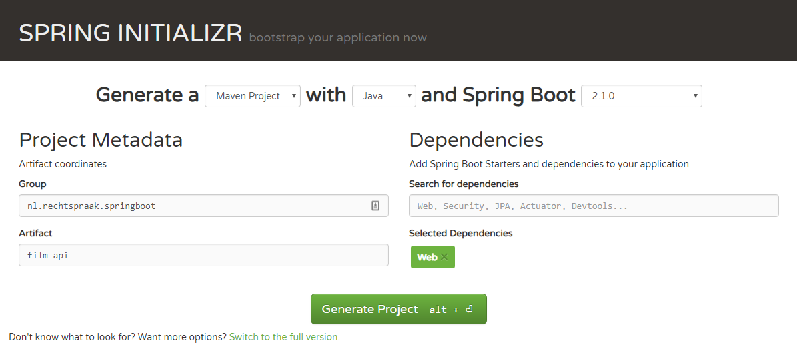

Klik nu op generate. Er wordt nu een zip gedownload met het startpunt voor onze Spring Boot applicatie.

Pak de zip uit op een gewenste locatie.

Start IntelliJ op.

Wanneer er nog geen IntelliJ projecten zijn kan gekozen worden voor import project, als er wel al een project is kan via `File` --> `New` --> `Project from Existing Sources` gekozen worden.

Kies de directory waar de uitgezipte Spring Boot applicatie staat. Klik op Ok.

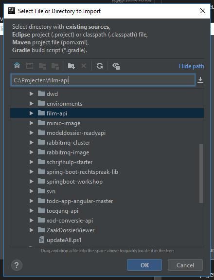

Kies voor externalmodel en maven. Klik op OK.

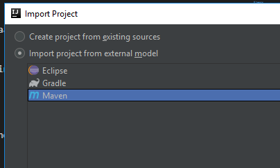

Next, Next, Kies de JDK. Als de lijst met JDK's leeg is, voeg er een toe:

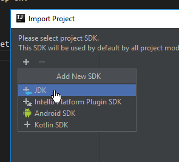

Kies de JAVA_HOME van de gewenste JDK. Klik op Ok.

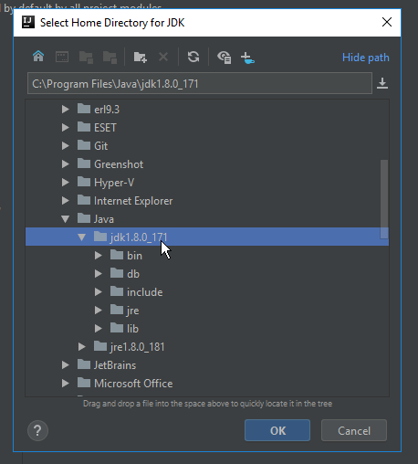

De JDK is nu toegevoegd. Selecteer deze en klik op Next. Next next finish!

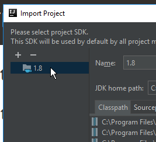

Het project is aangemaakt en de structuur ziet er als volgt uit:

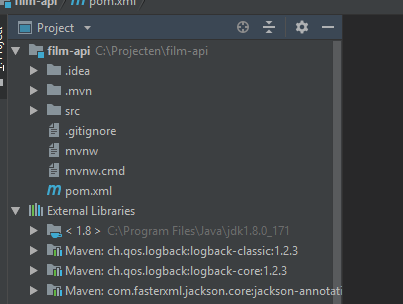

Let op: Als er geen vulling onder external libraries ontstaat kan het zijn dat de maven instellingen niet goed staan(vraag even aan een van de cursusleiders of ze je kunnen helpen).

### Film POJO maken

We gaan eerst een POJO aanmaken die een Film object representeert. Deze klasse gaat ervoor zorgen dat we in de code gestructureerde informatie kunnen doorgeven binnen de applicatie en tevens ervoor zorgen dat Spring (eigenlijk Jackson, een van de dependencies van Spring) deze netjes voor ons serialiseert naar JSON.

Maak een nieuwe klasse aan in package `[GROUP].[NAME].model` in ons geval: `nl.rechtspraak.springboot.filmapi.model` genaamd Film.

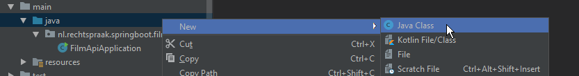
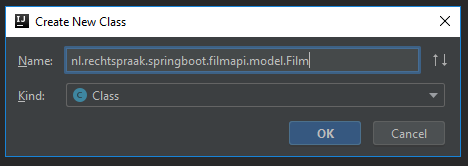

Deze POJO krijgt instantievariabelen die overeenkomen met het gewenste response:

```java
package nl.rechtspraak.springboot.filmapi.model;

import java.time.Duration;
import java.util.Set;

public class Film {
    private String titel;
    private int releaseJaar;
    private Set<String> acteurs;
    private Duration duur;
    private String id;
}
```

Genereer getters en setters voor alle instantievariabelen (`rechter muisknop` --> `Generate...` --> `Getters and Setters`, selecteer alle velden behalve acteurs en klik op ok).

Voor de acteurs gaan we enkel een getter genereren en zelf een `setActeurs` methode schrijven voor het gemak. De methode setActeurs ziet er als volgt uit:

```java
public void setActeurs(String... acteurs) {
    this.acteurs = new HashSet<>();
    this.acteurs.addAll(Arrays.asList(acteurs));
}
```

Deze methode vraagt een varargs argument voor acteurs op wat verderop (omdat wij de testdata aanleveren voor de eerste user story) van pas komt. Het komt erop neer dat we aan deze methode zoveel `String`s mee kunnen geven als wij willen.

Het is voor productiecode geen goed idee om ook setters te maken voor bv. id's of `Collecions`. 

Id's wil je niet zelf kunnen setten, deze worden doorgaans door een opslag gegenereerd worden (bv. o.b.v. een sequence). Ook zouden alleen getters voor funcionele id's gemaakt moeten worden, een afnemer heeft vaak niks aan een technische id.

Voor een collection zou je bij de getter een immutable variant van de collection kunnen teruggeven (door bv. `Collections.unmodifiableSet(this.acteurs)`) en in plaats van een setter een addActeur o.i.d.

In plaats van setter mag je er ook voor kiezen om alle velden via de constructor te setten (kan IntelliJ ook voor je genereren op ongeveer dezelfde manier als gettters en setters).

### Restcontroller aanmaken

Om java methodes aan de buitenwereld bloot te stellen kan met Spring een RestController worden aangemaakt. Deze klasse kan aangeven dat bepaalde code moet worden aangeroepen wanneer er een HTTP verzoek binnen komt op een bepaald `path`, met een bepaalde `methode`.

Hiervoor hebben wij eerst een Controller klasse nodig die een methode heeft die één film teruggeeft o.b.v. een id.

Maak een nieuwe klasse aan in package `[GROUP].[NAME].web` in ons geval: `nl.rechtspraak.springboot.filmapi.web` genaamd ApiController.

Annoteer de klasse (regel boven public class ApiController) met `@RestController` en met `@RequestMapping("films")`. 

De class signature ziet er als volgt uit:

```java
@RestController
@RequestMapping("films")
public class ApiController {
    ...
```

De `@RestController` zorgt ervoor dat deze klasse door Spring als controller wordt behandeld, dit houdt in dat het een bean is geworden en dat wij eventueel andere beans kunnen gaan injecteren (komen we later op terug).

De `@RequestMapping("films")` zorgt ervoor dat als er een HTTP-verzoek op [hostnaam:port/films] methoden uit deze klasse worden aangeroepen.

#### Initiele data aanmaken

Deze klasse moet een (paar) films bevatten om deze terug te kunnen geven o.b.v. hun id.

Hierbij wat code om een paar films aan te maken:

```java
private Set<Film> maakFilms() {
    final Set<Film> films = new HashSet<>();

    final Film film1 = new Film();
    film1.setTitel("The Ususal Suspects");
    film1.setReleaseJaar(1995);
    film1.setDuur(Duration.ofMinutes(106));
    film1.setRegisseur("Bryan Singer");
    film1.setActeurs("Kevin Spacey", "Gabriel Byrne", "Chazz Palminteri");
    film1.setId("123");

    final Film film2 = new Film();
    film2.setTitel("Donnie Darko");
    film2.setReleaseJaar(2001);
    film2.setDuur(Duration.ofMinutes(113));
    film2.setRegisseur("Richard Kelly");
    film2.setActeurs("Jake Gyllenhaal", "Jena Malone", "Mary McDonnell");
    film2.setId("456");

    final Film film3 = new Film();
    film3.setTitel("Once Upon a Time in the West");
    film3.setReleaseJaar(1968);
    film3.setDuur(Duration.ofMinutes(165));
    film3.setRegisseur("Sergio Leone");
    film3.setActeurs("Henry Fonda", "Charles Bronson", "Claudia Cardinale");
    film3.setId("789");

    films.add(film1);
    films.add(film2);
    films.add(film3);

    return films;
}
```

#### Film op basis van ID ophalen
Nu wij een `Set` van films hebben kunnen we op basis van een id de juiste `Film` terug geven. Dit kan op de java 6/7 manier door middel van een 'enhanced-for-loop':

```java
for (final Film film: films) {
    if (film.getId().equals(id)) {
        return film;
    }
    // Een fout gooien, want opgevraagde film bestaat niet
}
```

of op de java 8 d.m.v. de stream-api:

```java
final Optional<Film> zoekresultaat = films.stream().filter(film -> film.getId().equals(id)).findFirst();
if (zoekresultaat.isPresent()) {
    return zoekresultaat.get();
}
// Een fout gooien, want opgevraagde film bestaat niet
```

Maak een public methode die een `Film` als return type heeft en een `String` als input krijgt. 

Annoteer de methode met `@GetMapping("{id}")`.

Annoteer `String` (het input argument, de annotatie kan voor de `(String id)` --> `(@Annotatie(bla = bla) String id)`) met `@PathVariable("id")`. Dit zorgt ervoor dat het als er in de GET-mapping iets tussen accolades staat (in ons geval `id`), deze als input argument wordt gebruikt voor de methode.

De method signature ziet er nu als volgt uit:
```java
@GetMapping("{id}")
public Film getFilm(@PathVariable("id") String id) {
    ...
}
```

Zorg ervoor dat de implementatie van de methode de juiste film terug geeft o.b.v. het opgegeven id.

Nu het moment van de waarheid: het opstarten van de applicatie!!!!!

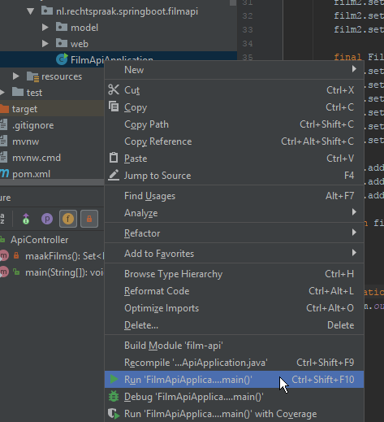

Controleer of de Spring Boot applicatie de juiste film terug geeft door de applicatie aan te roepen m.b.v. Postman.

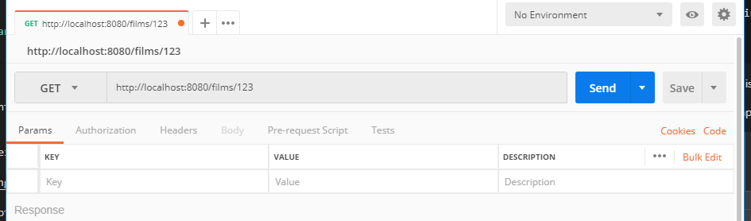
