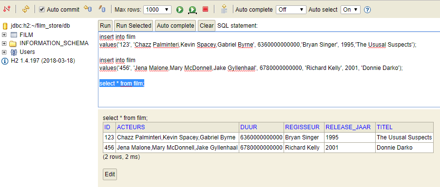

# MVE-4: Persisteren films
In deze story gaan we ervoor zorgen dat de films gepersisteerd kunnen worden in een simpele file-based h2 database die in dezelfde JVM komt te draaien als de applicatie.

## Acceptatie criteria
Als filmliefhebber wil ik, dat de lijst van alle films opgeslagen wordt zodat ik toegevoegde films niet kwijt ben als de applicatie opnieuw wordt opgestart.

## Stappenplan
* Toevoegen dependencies aan Pom file
* `Film` klasse aanpassen
* Aanmaken `FilmRepository`
* Aanpassen `FilmService` voor het gebruik van de repository
* Toevoegen application.properties
* `StringSetConverter` aanmaken
* Start de applicatie en bekijk de H2 database console
* Database vullen
* Test de applicatie


### Toevoegen dependencies aan Pom file
Voeg de twee onderstaande dependencies toe aan de pom file.
De dependencies zorgen voor Spring Data JPA en voor de light-weight H2 database.  

    <dependency>
        <groupId>org.springframework.boot</groupId>
        <artifactId>spring-boot-starter-data-jpa</artifactId>
    </dependency>
    <dependency>
        <groupId>com.h2database</groupId>
        <artifactId>h2</artifactId>
    </dependency>
    
Zorg er voor dat maven de dependencies laad indien InteliJ dit niet automatisch doet.   

### `Film` klasse aanpassen
Pas de Film klasse aan, geeft deze de @Entity Annotatie.
Geef de variable id de @Id annotatie.

Later zullen we de @Converter toelichten.

```java
@Entity
public class Film {

    private String titel;
    private int releaseJaar;

    @Convert(converter = StringSetConverter.class)
    private Set<String> acteurs = new HashSet<>();

    private Duration duur;
    private String regisseur;

    @Id
    @GeneratedValue
    private int id;
    
    ...
}
```

### Aanmaken van de `FilmRepository`
Om Films op te slaan maken we gebruik van de standaard CRUD repository (Create, Read, Update, Delete).
De FilmRepository zal die extenden.

De interface heeft geen implementatie. 

```java
package nl.rechtspraak.springboot.filmapi.doa;

import nl.rechtspraak.springboot.filmapi.model.Film;
import org.springframework.data.repository.CrudRepository;

public interface FilmRepository extends CrudRepository<Film, String> { }
```

### Aanpassen `FilmService` voor het gebruik van de repository
Gebruik dependency injection om de FilmRepostory mee te geven aan de FilmService.

```java
@Autowired
private FilmRepository repository;
```

Vervang de methode voor het gebruik van de `FilmRepository`
Gebruik:
* `findById(int id)`
* `findAll()`
* `save(Film film)`

```java
public void add(Film film){ repository.save(film); }

public Collection<FilmlijstItem> getFilms() {
    Stream<Film> filmStream = StreamSupport.stream(repository.findAll().spliterator(), false);
    return filmStream.map(FilmlijstItem::new).collect(Collectors.toSet());
}

public Optional<Film> getFilm(int id) { return repository.findById(id); }
```

### Toevoegen application.properties
Maak het application.properties bestand aan in de resource folder. Deze zorgt voor de juiste instellingen van de H2 
database.

```properties
# Enabling H2 Console
spring.h2.console.enabled=true
spring.h2.console.settings.trace=false

spring.data.jpa.repositories.enabled=true

spring.datasource.url=jdbc:h2:~/film_store/db;DB_CLOSE_ON_EXIT=FALSE

spring.jpa.hibernate.dialect=org.hibernate.dialect.H2Dialect
spring.jpa.hibernate.ddl-auto=update

spring.jpa.properties.hibernate.show_sql=true
```

### StringSetConverter aanmaken
Hibernate detecteert een lijst van acteurs. Daar zou deze een sub-tabel van maken. 
Om all acteurs als 1 string in dezelfde kolom op te slaan maken we gebruik van een 
Attribute converter. Maak deze klasse aan in de model.

```java
package nl.rechtspraak.springboot.filmapi.model;

import javax.persistence.AttributeConverter;
import javax.persistence.Converter;
import java.util.Arrays;
import java.util.HashSet;
import java.util.Set;

@Converter
public class StringSetConverter implements AttributeConverter<Set<String>, String> {

    @Override
    public String convertToDatabaseColumn(Set<String> list) {
        return String.join(",", list);

    }

    @Override
    public Set<String> convertToEntityAttribute(String joined) {
        return new HashSet<String>(Arrays.asList(joined.split(",")));
    }

}
```

### Start de applicatie en bekijk de H2 database console
Start de applicatie door op Run (Shift-F10) te klikken. 

Navigeer naar localhost:8080/h2-console

Vervang de JDBC url door: jdbc:h2:~/film_store/db


### Database vullen 
Tijdens het starten worden de tabellen in de H2 database automatisch aangemaakt door hibernate. 

Gebruik de onderstaande sql code om de database te vullen in de h2-console:
```sql
insert into film
values(123, 'Chazz Palminteri,Kevin Spacey,Gabriel Byrne', 6360000000000,'Bryan Singer', 1995,'The Ususal Suspects');

insert into film
values(456, 'Jena Malone,Mary McDonnell,Jake Gyllenhaal', 6780000000000, 'Richard Kelly', 2001, 'Donnie Darko');
```

Controleer de aanwezigheid:


### Test de applicatie
Controleer de functionaliteit van de applicatie. Blijven de films bewaard als de applicatie opnieuw wordt opgestart?